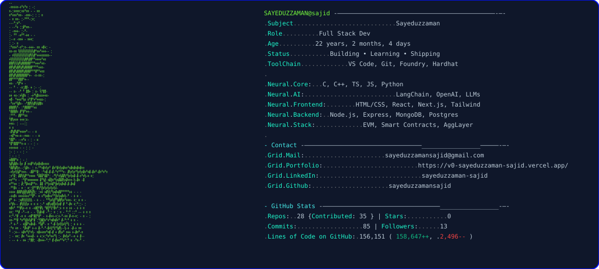
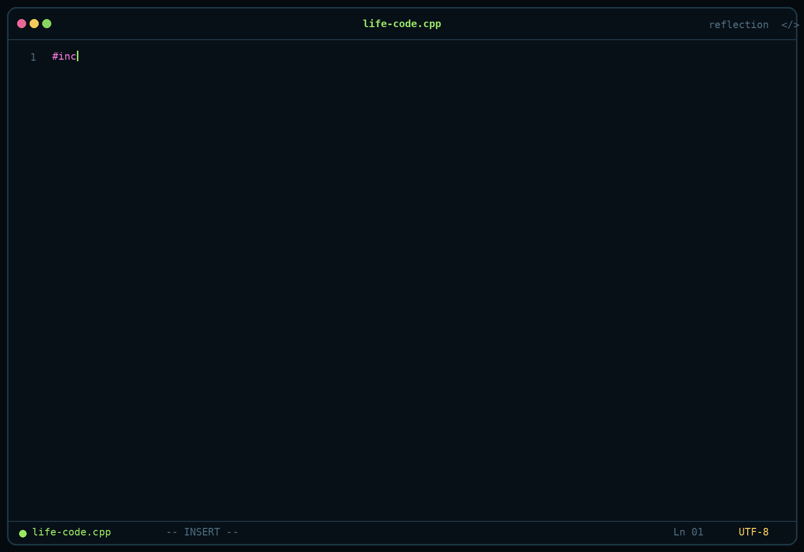

<div align="center">
 <!--   -->
  
</div> 

<!-- <div align="center">
  <picture>
    <source
      srcset="assets/dark.svg"
      media="(prefers-color-scheme: dark)">
    <source
      srcset="assets/light.svg"
      media="(prefers-color-scheme: light)">
    
  </picture>
</div> -->
<!-- <div align="center">
  
</div> -->

<p align="center">
  
</p>

<br>

<div align="center">
  <a href="https://www.linkedin.com/in/sayeduzzaman-sajid/">
    
  </a>
  <a href="mailto:sayeduzzamansajid@gmail.com">
    
  </a>
  <a href="https://leetcode.com/u/sayeduzzamansajid/">
    
  </a>
  <a href="https://vjudge.net/user/sayeduzzaman">
    
  </a>
  <a href="https://www.hackerrank.com/profile/sayeduzzaman">
    
  </a>
  <a href="https://www.codechef.com/users/void_function">
    
  </a>
  <a href="https://codeforces.com/profile/sayeduzzaman_sajid">
    
  </a>
  <a href="https://v0-sayeduzzaman-sajid.vercel.app/">
    
  </a>
 <br/>
  <a href="https://www.facebook.com/sayeduzzaman.sajid/">
    
  </a>
  <a href="https://www.instagram.com/sayeduzzaman.sajid/">
    
  </a>
  <a href="https://x.com/sayeduzzaman_">  </a>
</div>

<div  align="center">


[](https://github.com/sayeduzzamansajid)


</div>

<!-- --- -->


<!-- Banner -->
<!-- <p align="center">
  
</p> -->

<!-- <h1 align="center">👋 Hi, I'm Sayeduzzaman</h1>

<div align="center">

**A passionate Software Engineer** · Bangladesh 🇧🇩
<p align="center">
Building scalable, user-focused web applications
</p>


</div> -->

<!-- --- -->

<!-- <p align="center">
  
</p> -->

---

##  Life.cpp

<!--
<p align="center">
  
</p>
-->


```cpp
#include <life.h>
using namespace reflection;

bool Jannah( Aqeedah& iman, Tawakkul& reliance, Discipline& efforts)
{
    if ( !iman.valid() || iman.hasShirk() )
        return false;

    Allah.witnesses(reliance);
    Allah.accepts(efforts);
    return Allah.wills();
}

Outcome existence(Aqeedah iman, Tawakkul reliance, Discipline efforts)
{
    if (life.begin())
    {
        believe(Allah);
        follow(Deen);

        choose(Purpose);
        inherit(Dreams);

        build(Character);
        trust(Process);

        set(Goals);
    }

    while ( !life.end() ){
        try{
            if (efforts > 0){
                while ( !life.success() && life.hasTime() ){
                    auto lesson = identifyFault(efforts);
                    
                    learn(lesson);
                    improve(efforts);
                    retry(efforts);
                }
                life.happiness();
            }
            else
                throw life.failure();
        }
        catch (Exception &event){
            life.accept(event);
            continue;
        }
    }

    return Jannah(iman, reliance, efforts) ? Heaven : Hell;
}
```
---

## 👨‍💻 About Me

I am a aspiring **Software Engineer** with a strong interest in building modern, scalable, and responsive web applications.  
I enjoy working with both frontend and backend technologies to create complete solutions.  
Currently, I am improving my full-stack skills by building real-world projects and learning advanced web technologies.

---

<!-- ## 🚀 Current Activities

- 🌱 Exploring **Next.js**
- 🛠 Working on a **Coaching Management System**
- 📚 Strengthening backend skills with **Node.js & MongoDB**
- 🔍 Learning best practices for clean and maintainable code

--- -->

<!--
## 🧰 Skills

**Languages**

 &nbsp;
 &nbsp;
 &nbsp;
 &nbsp;
 &nbsp;
 &nbsp;

**Frontend**

 &nbsp;
 &nbsp;
 &nbsp;
 &nbsp;
 &nbsp;
 &nbsp;
 &nbsp;
 &nbsp;

**Backend & API**

 &nbsp;
 &nbsp;
 &nbsp;
 &nbsp;
 &nbsp;

**Databases**

 &nbsp;
 &nbsp;
 &nbsp;
 &nbsp;

**DevOps & server**

 &nbsp;
 &nbsp;
 &nbsp;
 &nbsp;
 &nbsp;
 &nbsp;
 &nbsp;
-->

## 🧰 Skills

### 💻 Languages


### 🎨 Frontend


### ⚙️ Backend & API


### 🗄️ Databases


### 🚀 DevOps & Tools


<!-- ---

## 🔗 Connect With Me

- 💼 **LinkedIn:** https://www.linkedin.com/in/sayeduzzaman-sajid
- 🐙 **GitHub:** https://github.com/sayeduzzamansajid 
- 📧 **Email:** sayeduzzamansajid9@gmail.com  
- 📍 **Location:** Chittagong | Bangladesh   -->

---

## 📊 GitHub Stats
<br />


<div align="center">

<a href="https://github.com/sayeduzzamansajid">
  
</a>

<a href="https://github.com/sayeduzzamansajid">
  
</a>

<p >
  
</p>

</div>

---

### 📈 Activity & 3D Contribution

<div align="center">

**Commit activity**


<br>
<!-- 
**3D contribution**

[](https://github.com/Ashutosh00710/github-readme-activity-graph)

<!--

-->


---


<!-- ### 🎮 Contribution

<picture>
  <source media="(prefers-color-scheme: dark)" srcset="https://raw.githubusercontent.com/mariyasf/mariyasf/output/pacman-contribution-graph-dark.svg">
  <source media="(prefers-color-scheme: light)" srcset="https://raw.githubusercontent.com/mariyasf/mariyasf/output/pacman-contribution-graph.svg">
  
</picture>
--- -->

<div align="center">

⭐ **Thank you for visiting my profile!**  
Feel free to connect or explore my projects. <br/>
[GitHub](https://github.com/sayeduzzamansajid) · [LinkedIn](https://www.linkedin.com/in/sayeduzzamansajid/) · [Email](mailto:sayeduzzamansajid@gmail.com)

</div>

<!-- [](https://github.com/sayeduzzamansajid) -->
<!-- [](https://www.linkedin.com/in/sayeduzzaman-sajid/)
[](mailto:sayeduzzamansajid@gmail.com) -->

</div>
<p align="center">
     
</p>


<!-- <p align="center">
  
</p>

<p align="center">
  
</p>

<p align="center">
  
</p> -->

---

<!-- ## 📌 Pinned Projects

Check out my pinned repositories to see:
- Client-side projects
- Full-stack MERN applications
- Assignment and practice projects

Each project includes:
- Live project link  
- Technologies used  
- Features overview  
- Setup guide   --> 

<!-- <!-- --- -->

<!--  -->


<!-- **Hosting:** ExonHost KVM -->

